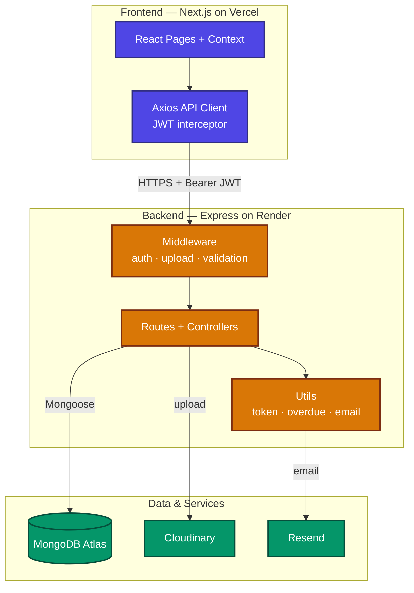

# Society Maintenance Tracker

A full-stack platform that helps apartment societies manage maintenance complaints from start to finish. Residents raise complaints with photos and track their progress; admins manage them through a clear workflow with priorities, overdue detection, and a notice board; and everyone stays informed through email updates.

## Live Demo

- **Frontend (Vercel):** https://YOUR-APP.vercel.app
- **Backend API (Render):** https://YOUR-API.onrender.com

> The backend runs on Render's free tier, which sleeps after 15 minutes of inactivity. The first request after idle may take 30–50 seconds to wake up. Subsequent requests are fast.

## Architecture



## Table of Contents

- [Features](#features)
- [Tech Stack](#tech-stack)
- [Project Structure](#project-structure)
- [Getting Started](#getting-started)
- [Environment Variables](#environment-variables)
- [Documentation](#documentation)

## Features

### Residents
- Register and log in (JWT auth)
- Raise a complaint with a category, description, and optional photo
- View all their complaints with the full status history of each
- Receive an email when a complaint's status changes
- Receive an email when an important notice is posted
- View the society notice board

### Admins
- View all complaints across the society
- Filter complaints by category, status, or date
- Set a priority (Low, Medium, High)
- Update complaint status (Open → In Progress → Resolved), with each change recorded (timestamp, actor, optional note)
- Resolved complaints are automatically closed and locked
- Overdue complaints (open beyond a configurable threshold) surface at the top
- Post notices to the notice board; important notices are pinned and emailed to all residents
- View a dashboard: complaints by status, by category, and overdue count

### System
- Role-based access control (resident / admin)
- Complaint lifecycle with a complete, append-only status history
- Photo upload handling via Cloudinary
- Configurable overdue detection
- Email notifications via Resend
- Light / dark theme

## Tech Stack

| Layer | Technology |
|-------|-----------|
| Frontend | Next.js (App Router), React, Tailwind CSS |
| Backend | Node.js, Express |
| Database | MongoDB (Mongoose ODM) |
| Auth | JWT + bcrypt |
| File storage | Cloudinary |
| Email | Resend |
| Hosting | Vercel (frontend), Render (backend) |

## Project Structure

```
society-maintenance-tracker/
├── client/                  # Next.js frontend
│   └── src/
│       ├── app/             # Pages (App Router)
│       ├── components/      # Reusable UI components
│       ├── context/         # Auth + Theme context
│       └── lib/             # Axios API client
├── server/                  # Express backend
│   └── src/
│       ├── config/          # DB + Cloudinary config
│       ├── controllers/     # Route handlers
│       ├── middleware/      # Auth, upload, validation
│       ├── models/          # Mongoose schemas
│       ├── routes/          # API routes
│       ├── utils/           # Email, overdue, token helpers
│       ├── app.js           # Express app setup
│       └── server.js        # Entry point
├── docs/
│   ├── API.md               # Full API reference
│   ├── SCHEMA.md            # Database schema
│   └── DESIGN.md            # System design write-up
└── README.md
```

## Getting Started

### Prerequisites
- Node.js 18+ and npm
- A MongoDB Atlas account (or local MongoDB)
- A Cloudinary account (free tier)
- A Resend account (free tier)

### 1. Clone the repository
```bash
git clone https://github.com/mauli-009/society-maintenance-tracker.git
cd society-maintenance-tracker
```

### 2. Set up the backend
```bash
cd server
npm install
cp .env.example .env   # then fill in your values (see below)
npm run dev            # runs on http://localhost:5000
```

### 3. Set up the frontend
```bash
cd ../client
npm install
cp .env.example .env.local   # set NEXT_PUBLIC_API_URL
npm run dev                  # runs on http://localhost:3000
```

### 4. Create an admin account
Register normally, then either register with `"role": "admin"` in the request body (for local testing) or update the user's `role` field to `admin` directly in the database.

## Environment Variables

### Backend (`server/.env`)
| Variable | Description |
|----------|-------------|
| `PORT` | Server port (default 5000) |
| `MONGO_URI` | MongoDB connection string |
| `JWT_SECRET` | Secret for signing JWTs |
| `JWT_EXPIRE` | Token lifetime (e.g. `7d`) |
| `OVERDUE_DAYS` | Days before an open complaint is overdue |
| `CLOUDINARY_CLOUD_NAME` | Cloudinary cloud name |
| `CLOUDINARY_API_KEY` | Cloudinary API key |
| `CLOUDINARY_API_SECRET` | Cloudinary API secret |
| `RESEND_API_KEY` | Resend API key |
| `EMAIL_FROM` | Sender address (e.g. `onboarding@resend.dev`) |
| `CLIENT_URL` | Allowed frontend origin(s) for CORS |

### Frontend (`client/.env.local`)
| Variable | Description |
|----------|-------------|
| `NEXT_PUBLIC_API_URL` | Backend base URL, ending in `/api` |

## Documentation

- **[API Reference](docs/API.md)** — every endpoint, request, and response
- **[Database Schema](docs/SCHEMA.md)** — models and relationships
- **[System Design](docs/DESIGN.md)** — architecture and key design decisions

## License

MIT