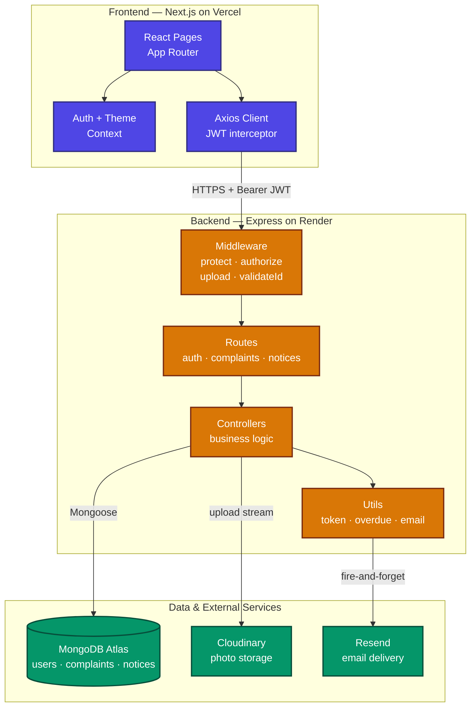
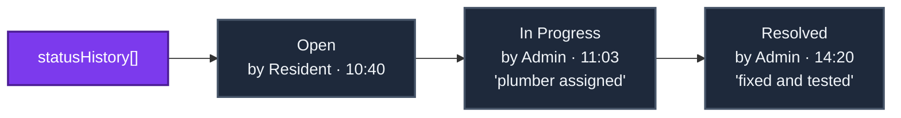
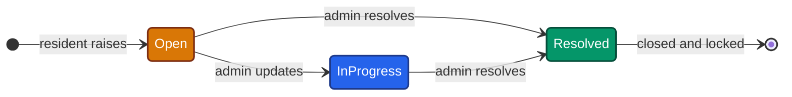
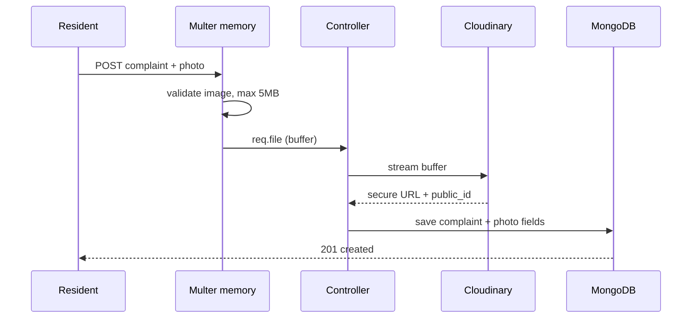
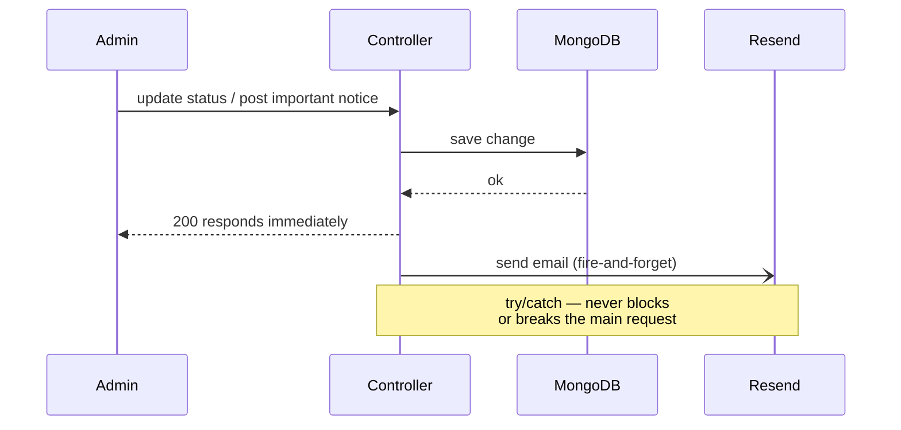

# System Design Write-Up

Society Maintenance Tracker is a full-stack complaint-management platform built with a Next.js frontend, an Express/Node backend, and MongoDB. This document explains the architecture and four core design areas: the complaint history model, overdue detection, photo handling, and the notification flow.

## System Architecture

The frontend is fully decoupled from the backend and talks to it over a REST API. The backend is stateless — all state lives in MongoDB, with photos offloaded to Cloudinary and email to Resend — which lets it scale horizontally and run on ephemeral hosting.

## Complaint History Model

Every status change must be auditable — who changed it, when, and why. This is modeled as an **embedded, append-only array** (`statusHistory`) inside each complaint rather than a separate collection.

Each entry stores the new `status`, an optional `note`, the acting user (`changedBy`), and a timestamp. On creation, the array is seeded with an "Open" entry so the trail begins at birth. Every admin update *appends* a new entry; existing entries are never mutated, guaranteeing a tamper-evident history.

Embedding was chosen over a referenced collection because the history is tightly bound to one complaint, always read with it, and naturally small (a handful of transitions). This avoids a join and keeps history atomically consistent. The complaint also carries a denormalized `status` mirroring the latest entry, so listing complaints is fast.

The lifecycle is enforced in the controller:

When status becomes `Resolved`, the complaint is flagged `isClosed`, stamped with `resolvedAt`, and locked — implementing the rule that a resolved complaint is closed.

## Overdue Detection

A complaint is overdue when it stays open beyond a configurable threshold (`OVERDUE_DAYS`, default 3), an env var so it needs no code change. Overdue status is **computed on read**: on each admin fetch, the backend compares every open complaint's age against the threshold. This is always accurate, needs no cron scheduler, and is simple to reason about. Resolved complaints are never overdue.

Overdue complaints surface at the top of the admin view. Sorting is done in JavaScript because priority strings would otherwise sort alphabetically; a numeric weight map yields the correct High → Medium → Low order. Final sort: overdue-first, then priority, then newest. The flag is also persisted via a bulk write so the dashboard's overdue count stays consistent. A daily cron job is a viable alternative but couples freshness to a scheduler; the on-read approach trades minor repeated computation for guaranteed accuracy.

## Photo Handling

Uploads use **Multer** with in-memory storage — the file is held as a buffer, never written to disk (which resets on redeploy). Multer validates image type and caps size before the controller. The buffer is streamed to **Cloudinary**, which returns a secure URL and `public_id`; both are stored (URL for display, ID for later deletion). This keeps the backend stateless and serves images over a CDN. If no photo is sent, the complaint is created with empty photo fields, keeping it optional.

## Notification Flow

Email uses **Resend**. Two events trigger it: a status change (emails the resident) and an important notice (emails all residents). Normal notices send nothing, avoiding spam. The service is **best-effort and non-blocking** — every send is wrapped in try/catch and never throws, so a failed email can't break a status update. Sends are fire-and-forget, so the API responds without awaiting delivery. If the API key is absent, sends skip gracefully.

## Cross-Cutting Concerns

Authentication uses stateless **JWT** with bcrypt-hashed passwords. Two middleware enforce access: `protect` verifies the token and attaches the user; `authorize(role)` restricts admin routes. The backend is the source of truth; frontend role checks are for UX only. CORS is restricted to known origins, and a reusable ObjectId validator returns clean 400s on malformed IDs — together giving clear resident/admin separation while keeping the API stateless and scalable.